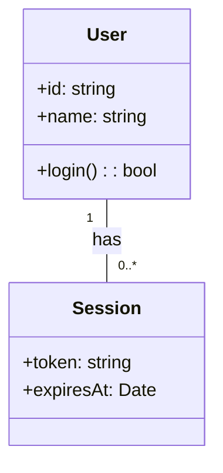
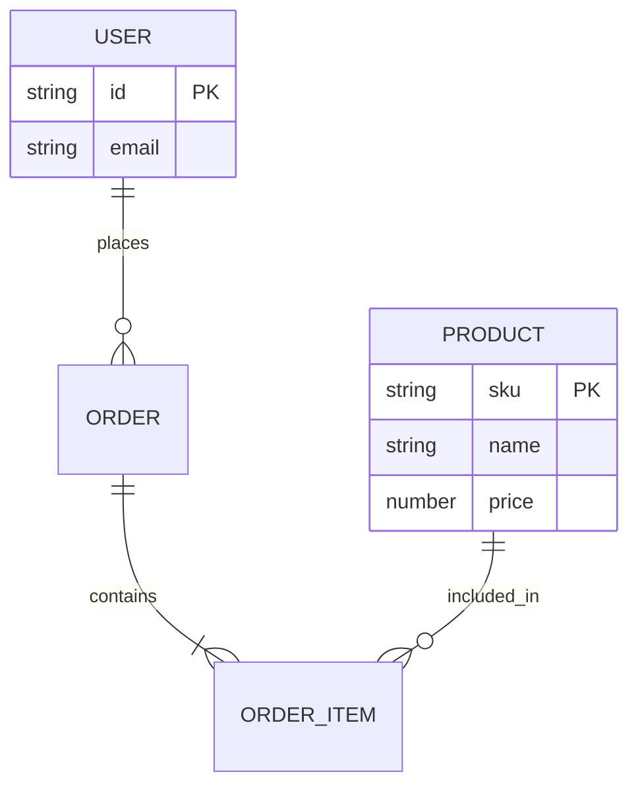
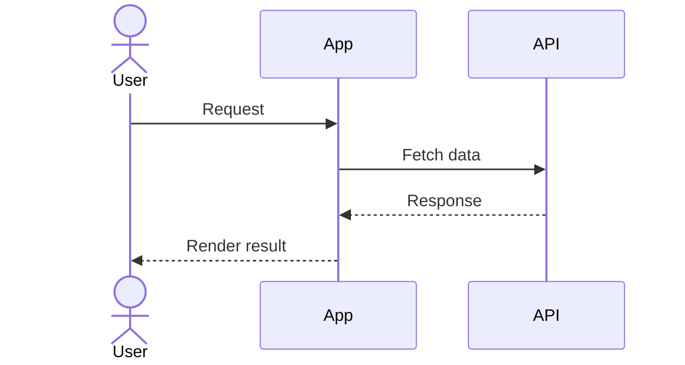
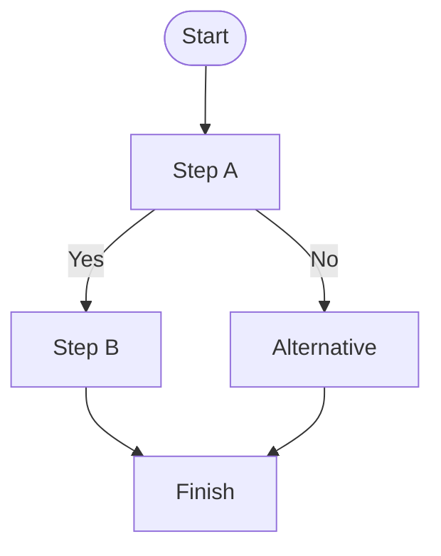

# Class diagram





# ER diagram





# Sequence diagram



# Flowchart




[[prompt]]

## Windsurf 

Let me check this specific pattern across all files and see if this is causing layout issues.
"AndExpand" options in the files that need to be replaced with appropriate Grid properties

```cs
// This is a simplified representation of the event handler
private async void btn_getotp_Clicked(object sender, EventArgs e)
{
    // Show a loading spinner to the user
    ShowLoading(true);

    // --- CALL 1: CHECK USER TYPE ---
    // The 'await' keyword tells the app: "Pause here and wait for this call to finish."
    var userTypeResponse = await ApiClient.CheckUserTypeAsync(mobileNumber);

    // After the call finishes, the code resumes here.
    // Now, check if the first call was successful.
    if (userTypeResponse.IsSuccessful)
    {
        // --- CALL 2: VALIDATE USER ---
        // Because Call 1 was successful, we can now proceed to Call 2.
        // The code will 'await' again, pausing until this second call is complete.
        var validationResponse = await ApiClient.ValidateUserAsync(mobileNumber, userTypeResponse.UserType);

        if (validationResponse.IsSuccessful)
        {
            // --- CALL 3: GET OTP ---
            // Both previous calls succeeded, so now we get the OTP.
            // The code 'awaits' one last time.
            var otpResponse = await ApiClient.GetOtpAsync(mobileNumber);

            if (otpResponse.IsSuccessful)
            .
            {
                // Show the OTP entry field to the user
            }
        }
    }

    // If any of the calls failed, the 'if' condition would be false,
    // and the subsequent calls would simply be skipped.
    // An error message would be shown instead.

    // Hide the loading spinner
    ShowLoading(false);
}
```


# All not in same context page 


```cs
private async void btn_getotp_Clicked(object sender, EventArgs e)

{

    if (await checkvalidtiongetotp())

    {

        Loading_activity.IsVisible = true;

        var service = new HitServices();

        int CheckUserType_Get = await service.CheckUserType_Get(entry_mobileno.Text);

        if (CheckUserType_Get == 200)

        {

            usertype = Preferences.Get("UserType", "");

            await service.LocalResources_Get();

  

            /* else if (usertype.Equals("Agent"))

                {

                    int response_getuser = await service.userlogin_Get(entry_mobileno.Text.ToString().Trim());

                    if (response_getuser == 200)

                    {

                        int response_getotp = await service.GetOtp(entry_mobileno.Text.ToString().Trim());

                        if (response_getotp == 200)

                        {

                            entry_mobileno.IsReadOnly = true;

                            btn_getotp.IsVisible = false;

                            stack_submitotp.IsVisible = true;

                            Loading_activity.IsVisible = false;

                        }

                    }

                }*/

            if (usertype.Equals("Observor"))

            {

                int response_getuser = await service.observorlogin_Get(entry_mobileno.Text.ToString().Trim());

                if (response_getuser == 200)

                {

                    int response_getotp = await service.GetOtp(entry_mobileno.Text.ToString().Trim());

                    if (response_getotp == 200)

                    {

                        entry_mobileno.IsReadOnly = true;

                        btn_getotp.IsVisible = false;

                        stack_submitotp.IsVisible = true;

                        Loading_activity.IsVisible = false;

                    }

                }

            }

            else if (usertype.Equals("Candidate") || usertype.Equals("Agent"))

            {

                Loading_activity.IsVisible = true;

                int response_getuser = await service.userlogin_Get(entry_mobileno.Text.ToString().Trim());

                //userDetailslist = userDetailsDatabase.GetUserDetails("Select * from UserDetails").ToList();

                if (response_getuser == 200)

                {

                    int response_getotp = await service.GetOtp(entry_mobileno.Text.ToString().Trim());

                    if (response_getotp == 200)

                    {

                        entry_mobileno.IsReadOnly = true;

                        btn_getotp.IsVisible = false;

                        stack_submitotp.IsVisible = true;

                        Loading_activity.IsVisible = false;

                    }

                }

            }

            else

            {

                await DisplayAlert("CERS", usertype, App.Btn_Close);

  

            }

        }

        else { entry_mobileno.Text=string.Empty; }

        Loading_activity.IsVisible = false;

    }

}
```