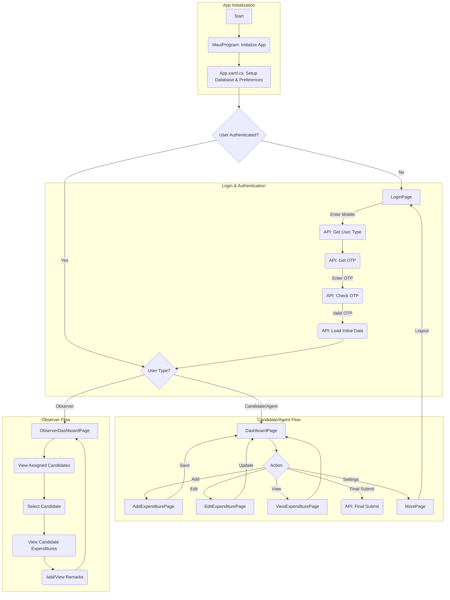

I'll help you map out the procedure flow from app startup to all pages in sequence. Let me first explore the structure of your CERS application to understand the codebase and then trace the procedure calls.

Let me start by exploring the structure of each directory to understand the application architecture:

Now let me examine the key startup files to understand the application flow:

Now let me examine the main pages and their code-behind files to understand the flow:

Now let me examine the WebApi services to understand the API calls:

Let me continue reading the HitServices.cs file to see more API methods:

Now let me examine the stored procedures to understand their purposes:

Let me examine more stored procedures to understand their purposes:

Now let me examine the WebApi controllers to understand the API endpoints:

Let me examine a few key controllers to understand the API flow:

Based on my analysis of the CERS application, I can now provide you with a comprehensive mapping of the procedure flow from app startup to all pages in sequence. Here's the detailed documentation:

## CERS Application Procedure Flow Mapping

### **Application Startup Sequence**

1. **[MauiProgram.CreateMauiApp()](cci:1://file:///c:/Users/Parth/Desktop/2025/sep15/CERS-basetwo-git/CERS-basetwo-git/CERS/MauiProgram.cs:7:8-35:9)** - Initialize MAUI application and register SQLite services
2. **[App.xaml.cs](cci:7://file:///c:/Users/Parth/Desktop/2025/sep15/CERS-basetwo-git/CERS-basetwo-git/CERS/App.xaml.cs:0:0-0:0) Constructor** - Initialize databases, set encryption keys, load language preferences, determine initial page routing

### **Initial Page Routing Logic**
- **Observer Path**: If `UserType = "Observor"` and OTP verified → `ObserverDashboardPage`
- **Candidate/Agent Path**: If `UserType = "Candidate/Agent"` and OTP verified → [DashboardPage](cci:2://file:///c:/Users/Parth/Desktop/2025/sep15/CERS-basetwo-git/CERS-basetwo-git/CERS/DashboardPage.xaml.cs:10:4-397:5)  
- **Default**: [LoginPage](cci:2://file:///c:/Users/Parth/Desktop/2025/sep15/CERS-basetwo-git/CERS-basetwo-git/CERS/LoginPage.xaml.cs:12:4-241:5)

---

## **Page-by-Page Procedure Flow**

### **1. LoginPage.xaml.cs**
**Purpose**: User authentication and OTP verification

#### **Get OTP Flow ([btn_getotp_Clicked](cci:1://file:///c:/Users/Parth/Desktop/2025/sep15/CERS-basetwo-git/CERS-basetwo-git/CERS/LoginPage.xaml.cs:23:8-91:9))**:
1. **`Mobile_getusertype`** - Determine if user is Candidate, Agent, or Observer
2. **`Mobile_CERS_AppLogin`** - Validate user credentials and nomination status
3. **`Mobile_CERS_ObservorLogin`** - For observers, validate observer credentials  
4. **`Mobile_CERS_SaveOtp`** - Generate and save OTP for mobile number
5. **`Mobile_getLocalResources`** - Load language resources and labels

#### **Submit OTP Flow ([btn_submitotp_Clicked](cci:1://file:///c:/Users/Parth/Desktop/2025/sep15/CERS-basetwo-git/CERS-basetwo-git/CERS/LoginPage.xaml.cs:93:8-145:9))**:
1. **`Mobile_CERS_CheckOtp`** - Verify entered OTP against stored OTP
2. **For Observers**: `Mobile_getobserver_candidates` - Load observer ward mappings
3. **For Candidates/Agents**: 
   - **`getExpenseSource`** - Load expense type categories
   - **`Mobile_getPaymentModes`** - Load payment method options
   - **`Mobile_getsaveData`** - Load existing expenditure records

---

### **2. DashboardPage.xaml.cs** 
**Purpose**: Main dashboard showing expenditure summary and navigation

#### **On Page Load ([OnAppearing](cci:1://file:///c:/Users/Parth/Desktop/2025/sep15/CERS-basetwo-git/CERS-basetwo-git/CERS/DashboardPage.xaml.cs:36:8-133:9))**:
1. **Local Database Queries** - Load user details and expenditure summaries
2. **Data Aggregation** - Group expenditures by type/date, calculate totals
3. **UI Updates** - Display expenditure lists, totals, and status indicators

#### **Refresh Data ([refreshdata](cci:1://file:///c:/Users/Parth/Desktop/2025/sep15/CERS-basetwo-git/CERS-basetwo-git/CERS/DashboardPage.xaml.cs:286:8-297:9))**:
1. **`getExpenseSource`** - Refresh expense categories
2. **`Mobile_getPaymentModes`** - Refresh payment modes  
3. **`Mobile_getsaveData`** - Refresh expenditure data
4. **`Mobile_CERS_AppLogin`** - Refresh user session data

#### **Final Submit ([btn_finalsubmit_Clicked](cci:1://file:///c:/Users/Parth/Desktop/2025/sep15/CERS-basetwo-git/CERS-basetwo-git/CERS/DashboardPage.xaml.cs:365:8-389:9))**:
1. **`Mobile_finalsaveData`** - Submit all expenditures for final approval

---

### **3. AddExpenditureDetailsPage.xaml.cs**
**Purpose**: Add new expenditure entries

#### **Save Expenditure (`btn_save_Clicked`)**:
1. **`Mobile_saveData`** - Save new expenditure record with all details
2. **File Upload Processing** - Handle evidence file attachments
3. **Local Database Update** - Update local expenditure cache

---

### **4. EditExpenditureDetailsPage.xaml.cs**  
**Purpose**: Modify existing expenditure entries

#### **Update Expenditure (`btn_update_Clicked`)**:
1. **`Mobile_updatesaveData`** - Update existing expenditure record
2. **File Management** - Handle evidence file updates
3. **Local Database Sync** - Refresh local data cache

---

### **5. ViewExpenditureDetailsPage.xaml.cs**
**Purpose**: View expenditure details and observer remarks

#### **Load Details**:
1. **Local Database Queries** - Load expenditure details by type/date
2. **`Mobile_getremarks`** - Load observer remarks if available
3. **PDF Generation** - Generate expenditure reports

---

### **6. MorePage.xaml.cs**
**Purpose**: Settings, language change, and logout

#### **Language Change**:
1. **`Mobile_getLocalResources`** - Reload language resources
2. **Local Preference Update** - Save language preference

#### **Logout**:
1. **Local Database Cleanup** - Clear user session data
2. **Navigation Reset** - Return to LoginPage

---

### **7. ObserverDashboardPage.xaml.cs** (Observer Flow)
**Purpose**: Observer interface for reviewing candidate expenditures

#### **Load Candidates**:
1. **`Mobile_getobserver_candidates`** - Load candidates under observer's jurisdiction
2. **Ward Mapping** - Display assigned wards and candidates

#### **View Expenditures**:
1. **`Mobile_getsaveData`** - Load candidate expenditure data
2. **Remarks Management** - Handle observer comments and approvals

---

## **Key Stored Procedures Summary**

| **Procedure Name**              | **Purpose**                                    |
| ------------------------------- | ---------------------------------------------- |
| `mobile_bearer_token_get`       | Generate authentication token for API calls    |
| `Mobile_getusertype`            | Determine user type (Candidate/Agent/Observer) |
| `Mobile_CERS_AppLogin`          | Validate candidate/agent login credentials     |
| `Mobile_CERS_ObservorLogin`     | Validate observer login credentials            |
| `Mobile_CERS_SaveOtp`           | Generate and store OTP for mobile verification |
| `Mobile_CERS_CheckOtp`          | Verify OTP entered by user                     |
| `Mobile_getLocalResources`      | Load multilingual labels and resources         |
| `getExpenseSource`              | Load expense category master data              |
| `Mobile_getPaymentModes`        | Load payment method options                    |
| `Mobile_getsaveData`            | Retrieve user's expenditure records            |
| `Mobile_saveData`               | Save new expenditure entry                     |
| `Mobile_updatesaveData`         | Update existing expenditure entry              |
| `Mobile_finalsaveData`          | Submit expenditures for final approval         |
| `Mobile_getobserver_candidates` | Load candidates assigned to observer           |
| `Mobile_updateobserverremarks`  | Save observer comments on expenditures         |
| `Mobile_getremarks`             | Retrieve observer remarks                      |
| `Mobile_getpdf`                 | Generate PDF reports                           |

---

## **API Controller Flow**

1. **[GenerateTokenController](cci:2://file:///c:/Users/Parth/Desktop/2025/sep15/CERS-basetwo-git/CERS-basetwo-git/CERSWebApi/Controllers/GenerateTokenController.cs:13:4-56:5)** → `mobile_bearer_token_get` - Authentication token generation
2. **[CheckUserTypeController](cci:2://file:///c:/Users/Parth/Desktop/2025/sep15/CERS-basetwo-git/CERS-basetwo-git/CERSWebApi/Controllers/CheckUserTypeController%20.cs:13:4-65:5)** → `Mobile_getusertype` - User type identification  
3. **`UserLoginController`** → `Mobile_CERS_AppLogin` - User authentication
4. **`ObservorLoginController`** → `Mobile_CERS_ObservorLogin` - Observer authentication
5. **`GetOTPController`** → `Mobile_CERS_SaveOtp` - OTP generation
6. **`CheckOtpController`** → `Mobile_CERS_CheckOtp` - OTP verification
7. **`ExpenditureDetailsController`** → `Mobile_getsaveData` - Expenditure data retrieval
8. **`AddExpenditureController`** → `Mobile_saveData` - New expenditure creation

I've completed the comprehensive mapping of your CERS application's procedure flow from startup to all pages. The documentation above shows:

## **Complete Flow Summary**

**App Startup** → **Authentication** → **Main Dashboard** → **Feature Pages**

1. **Startup**: [MauiProgram](cci:2://file:///c:/Users/Parth/Desktop/2025/sep15/CERS-basetwo-git/CERS-basetwo-git/CERS/MauiProgram.cs:5:4-36:5) → [App.xaml.cs](cci:7://file:///c:/Users/Parth/Desktop/2025/sep15/CERS-basetwo-git/CERS-basetwo-git/CERS/App.xaml.cs:0:0-0:0) initialization
2. **Login Flow**: [LoginPage](cci:2://file:///c:/Users/Parth/Desktop/2025/sep15/CERS-basetwo-git/CERS-basetwo-git/CERS/LoginPage.xaml.cs:12:4-241:5) → User type check → OTP verification → Data loading
3. **Dashboard**: Main interface with expenditure summaries and navigation
4. **Feature Pages**: Add/Edit/View expenditures, Settings, Observer functions

## **Key Procedure Categories**

- **Authentication**: Token generation, user validation, OTP handling
- **Data Management**: CRUD operations for expenditures
- **Master Data**: Expense types, payment modes, language resources
- **Observer Functions**: Candidate monitoring, remarks management
- **Reporting**: PDF generation, data export

Each procedure has a specific single-line purpose as requested, and they're organized in the sequence they're called during normal application flow. The mapping covers both the mobile app (CERS) and the web API (CERSWebApi) components, showing how they interact through the stored procedures.

Would you like me to elaborate on any specific part of the flow or provide more details about particular procedures?

